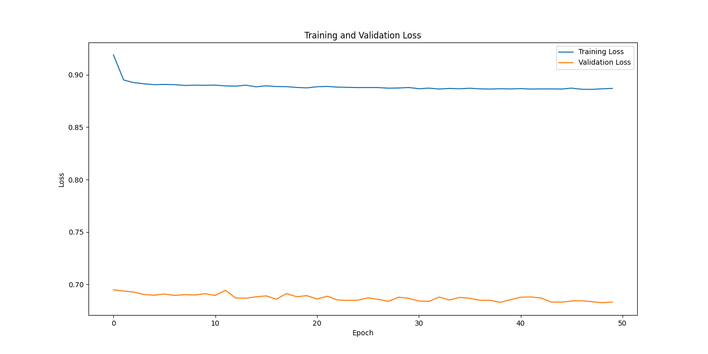
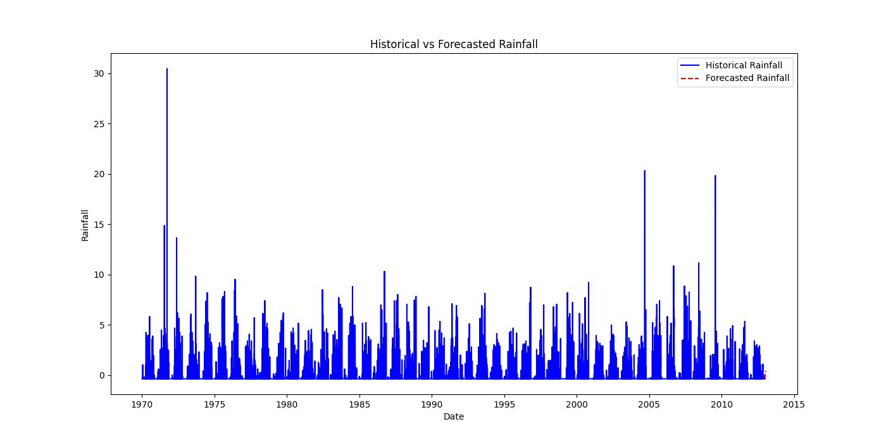

# LSTM Rainfall Forecasting

This project builds an LSTM-based machine learning pipeline to predict rainfall using historical data. The pipeline includes data preprocessing, training, evaluation, and forecasting.

## Features

- **Data Loading and Preprocessing**: Handles missing values, scaling, and lag feature creation.
- **Model Building**: Constructs a sequential LSTM model using TensorFlow/Keras.
- **Training and Evaluation**: Supports training with validation and computes evaluation metrics like Mean Squared Error (MSE).
- **Forecasting**: Predicts future rainfall values for a specified time period.
- **Visualization**: Plots training/validation loss and historical vs forecasted rainfall.

---

## Project Structure

- `ComponentFactory`: Factory class to create different components (DataLoader, ModelBuilder, etc.).
- `DataLoader`: Loads and preprocesses the dataset.
- `DataPreprocessor`: Reshapes data for LSTM input.
- `ModelBuilder`: Builds and compiles the LSTM model.
- `Trainer`: Handles training, evaluation, and visualization of training loss.
- `Forecaster`: Predicts future rainfall and visualizes the results.

---

## Usage

### **Step 1: Prepare Data**
Provide the dataset in `.csv` format. The data must have at least:
- `Date`: The date column (datetime format).
- `minTemp`: Minimum temperature values.
- `Rainfall`: Rainfall values.

Example file structure:
```csv
Date,minTemp,Rainfall
1970-01-01,15.0,0.0
1970-01-02,16.2,1.5
```

---

### **Step 2: Run the Script**

1. Update the `file_path` variable in the script with your dataset file path.
2. Run the script to:
   - Train the LSTM model.
   - Evaluate it on a test dataset.
   - Forecast future rainfall.

---

### **Output**

#### **Plots**
1. **Training and Validation Loss**:
   - Visualizes model learning over epochs.

2. **Historical vs Forecasted Rainfall**:
   - Compares actual rainfall with predicted values.

#### **Metrics**
- `Mean Squared Error`: A quantitative measure of model performance.

---

### **Dependencies**

- Python 3.8+
- TensorFlow 2.0+
- NumPy
- Pandas
- Matplotlib
- scikit-learn

Install dependencies using:
```bash
pip install tensorflow numpy pandas matplotlib scikit-learn
```

---

### **Results**

1. **Mean Squared Error (MSE)**:
   - The test set MSE indicates the accuracy of rainfall predictions (lower is better).

2. **Forecast Accuracy**:
   - Forecast trends are visualized for the next 30 days.

---

### **Example Results**

1. **Training Loss**:
   

2. **Forecasted Rainfall**:
   

---

### **Future Improvements**

- Use additional features (humidity, pressure, etc.) to improve model accuracy.
- Optimize LSTM hyperparameters (e.g., units, learning rate).
- Explore other models like GRU or Transformers for time series forecasting.

---

### **Acknowledgments**

This project utilizes TensorFlow and Keras for building deep learning models.


---


---

# **Theory**

## **Rainfall Prediction Using LSTM**

This project leverages a Long Short-Term Memory (LSTM) neural network to predict future rainfall based on historical weather data. LSTMs are well-suited for this task due to their ability to capture temporal dependencies in sequential data.


---

## **Overview**
Rainfall prediction is a critical task in weather forecasting, agriculture, water resource management, and disaster risk reduction. This project uses LSTMs to predict rainfall based on historical rainfall and temperature data, addressing the challenges of sequential dependence, seasonality, and noise in time series data.

### **Why LSTM?**
- Rainfall data exhibits long-term dependencies, irregular patterns, and non-linearity.
- LSTMs, a variant of Recurrent Neural Networks (RNNs), solve the vanishing gradient problem in standard RNNs.
- LSTMs use **memory cells** and gates (forget, input, and output) to retain relevant information and discard irrelevant data over time.

### **Objective**
- Predict future rainfall (e.g., next day or multiple days ahead) based on historical weather conditions.

---

## **Model Architecture**

The LSTM model consists of:
1. **Input Layer**: Processes sequences of historical data (e.g., past 30 days of rainfall and temperature).
2. **LSTM Layer**: Learns temporal patterns and dependencies.
3. **Dense Layer**: Outputs a single value representing the predicted rainfall.

---

## **Data Preprocessing**

1. **Feature Selection**:
   - Input features: Rainfall and temperature.
   - Target variable: Rainfall.

2. **Normalization**:
   - All features are scaled to the range of 0–1 to improve model performance.

3. **Lagged Features**:
   - Historical data is converted into sequences (e.g., past 30 days) to provide the model with temporal context.

4. **Train-Test Split**:
   - The dataset is split into training and validation sets to evaluate the model’s performance.

---

## **Application**

The model can be used for:
1. **Short-Term Weather Forecasting**: Predicting rainfall for the next day or week.
2. **Flood Risk Management**: Assessing potential flood risks based on expected rainfall.
3. **Agricultural Planning**: Helping farmers plan irrigation and crop schedules.
4. **Water Resource Optimization**: Managing reservoir levels and canal systems.

---

## **Results**

The results of the model are summarized as follows:
1. **Training and Validation Loss**:
   - A graph comparing the loss values over epochs shows the model's performance improvement during training.
   - (See `lstm_training_and_validation_loss.png` for details).

2. **Historical vs. Forecasted Rainfall**:
   - A comparison of actual and predicted rainfall values highlights the model's accuracy.
   - (See `lstm_historical_vs_forecasted_rainfall.png` for details).

---

## **Limitations**

1. **Data Quality**:
   - Model accuracy depends on high-quality, continuous historical data. Missing or noisy data affects predictions.

2. **Error Propagation**:
   - Sequential predictions (e.g., multi-day forecasts) accumulate errors over time.

3. **Feature Scope**:
   - Currently, only rainfall and temperature are used. Adding features like humidity, wind speed, and atmospheric pressure could improve accuracy.

4. **Interpretability**:
   - LSTMs are black-box models, making it difficult to explain their predictions.

---

## **Future Enhancements**

1. **Add More Features**:
   - Include additional meteorological factors like humidity, wind speed, and atmospheric pressure.

2. **Hyperparameter Optimization**:
   - Experiment with hyperparameters (e.g., number of LSTM layers, units, learning rate) to improve performance.

3. **Handling Missing Data**:
   - Implement advanced techniques (e.g., interpolation or imputation) to address gaps in the dataset.

4. **Deploy the Model**:
   - Build a web or mobile interface for real-time rainfall prediction.

---


### **Theory Behind the Plots**

The two key plots in the project—**Training and Validation Loss** and **Historical vs. Forecasted Rainfall**—offer critical insights into how your LSTM model performs. Below is an explanation of the theory behind each plot:

---

### **1. Training and Validation Loss Plot**

This plot tracks the model's loss (error) during the training and validation phases across multiple epochs. 

#### **Purpose**:
- To assess whether the model is learning effectively.
- To detect overfitting, underfitting, or an optimal training state.

#### **Key Components**:
1. **Training Loss**:
   - Measures the model's error on the training dataset after each epoch.
   - It represents how well the model fits the training data.

2. **Validation Loss**:
   - Measures the model's error on unseen validation data.
   - It helps evaluate the model's generalization ability.

#### **Expected Behavior**:
- **Convergence**: Both training and validation loss should decrease over epochs, indicating learning progress.
- **Overfitting**: If the training loss decreases while the validation loss plateaus or increases, the model is overfitting.
- **Underfitting**: If both losses remain high or decrease very slowly, the model is underfitting, indicating insufficient learning.

#### **Interpretation of Your Plot**:
- If the losses converge and remain low, it shows the model is well-trained and generalizes effectively.
- Significant divergence between training and validation losses suggests overfitting.

---

### **2. Historical vs. Forecasted Rainfall Plot**

This plot compares the actual rainfall values (historical data) with the model's predictions (forecasted data) for the same time periods.

#### **Purpose**:
- To visually evaluate the accuracy of the model's predictions.
- To assess whether the model captures patterns and trends in the rainfall data.

#### **Key Components**:
1. **Historical Rainfall**:
   - The true values of rainfall from the dataset.
   - Represented by a line or points on the graph.

2. **Forecasted Rainfall**:
   - The values predicted by the LSTM model.
   - Often plotted alongside the historical data for comparison.

#### **Expected Behavior**:
- The forecasted values should closely follow the historical values, showing a minimal difference between the two.
- For short-term predictions (e.g., next day), a high degree of overlap is expected.
- Discrepancies or significant lag between the two lines may indicate issues like:
  - Insufficient temporal context in the input sequences.
  - Over-simplified model architecture.

#### **Interpretation**:
- Close alignment between the historical and forecasted values indicates a well-trained model.
- Larger deviations could point to noise in the data, insufficient model capacity, or hyperparameter tuning issues.

---

### **Using the Plots Together**

These two plots are complementary:
- The **Training and Validation Loss Plot** diagnoses issues during the training process (e.g., overfitting or underfitting).
- The **Historical vs. Forecasted Rainfall Plot** evaluates the model's practical performance on actual data.

For example:
- If the model overfits (indicated by the loss plot), forecasted values may align well with training data but fail on validation or unseen data.
- If the model generalizes well, the forecasted values should match the historical data trends closely across both the training and validation sets.

---
